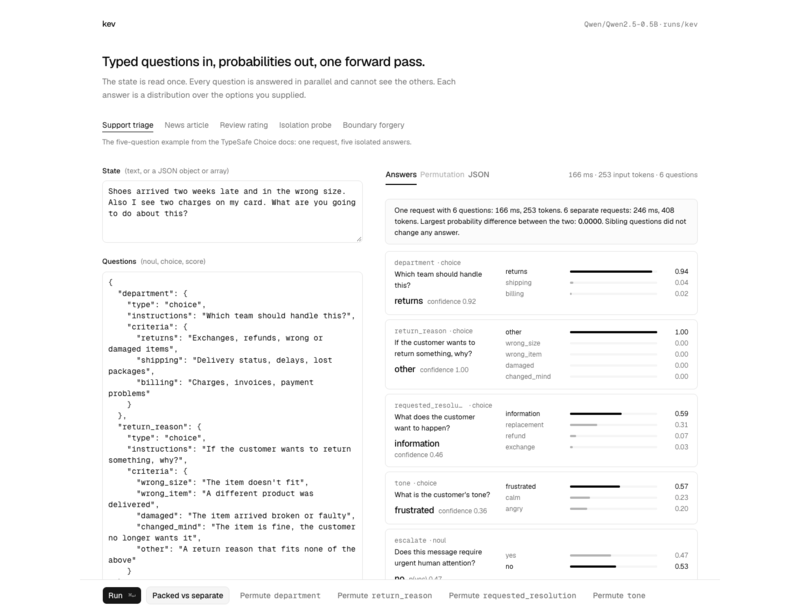

<picture>
  <source media="(prefers-color-scheme: dark)" srcset="media/banner-dark.svg">
  
</picture>

# Awesome Jev 

[Search the site](https://awesomejev.vercel.app) · [Categories](#contents) · [Contribute](#contributing) · [Agent skill](SKILL.md) · [llms.txt](https://awesomejev.vercel.app/llms.txt) · [中文](README.zh-CN.md) · [日本語](README.ja.md) · [한국어](README.ko.md)

> [!TIP]
> Agents can install this list as a skill: `npx skills add valentynkit/awesome-jev-typesafe`. It teaches them to fetch [projects.json](https://awesomejev.vercel.app/projects.json) once and filter locally.

Typed decisions from TypeSafe's Jev, the first System One model: state in, calibrated probabilities out, no text to parse.

Jev does not write. You hand it some state and a list of typed questions, and it answers each one with a probability, a pick from options you defined, or a position on a scale you defined. One request, about 100 ms, $0.042 per million input tokens, output free, every question scored in parallel. This list is where people are putting that to work, sorted by what you would install.

<table>
  <tr>
    <td align="center"><a href="https://github.com/browser-use/jev-ultrafast"> jev-ultrafast</a></td>
    <td align="center"><a href="https://github.com/ChetasLua/jevmeter"> jevmeter</a></td>
    <td align="center"><a href="https://github.com/RomanSlack/jev-drone"> jev-drone</a></td>
  </tr>
  <tr>
    <td align="center"><a href="https://github.com/devagrawal09/jev-review"> jev-review</a></td>
    <td align="center"><a href="https://github.com/jaredpalmer/kev"> kev</a></td>
    <td align="center"><a href="https://github.com/AbdelStark/heist-one"> heist-one</a></td>
  </tr>
</table>

## Contents

- [Jev on one screen](#jev-on-one-screen)
- [Know before you build](#know-before-you-build)
- [Start here](#start-here)
- [Official SDKs and framework support](#official-sdks-and-framework-support)
- [Coding agents](#coding-agents)
  - [Claude Code](#claude-code)
  - [Codex](#codex)
  - [Pi](#pi)
  - [Hermes](#hermes)
  - [Agent Zero](#agent-zero)
  - [Any agent](#any-agent)
  - [Skills for writing Jev code](#skills-for-writing-jev-code)
- [Browser and computer use](#browser-and-computer-use)
- [Open models and replicas](#open-models-and-replicas)
- [Code review and quality](#code-review-and-quality)
- [Routing and gateways](#routing-and-gateways)
- [Search, reranking and RAG](#search-reranking-and-rag)
- [Data and ops](#data-and-ops)
- [Safety, moderation and verification](#safety-moderation-and-verification)
- [Applications and extensions](#applications-and-extensions)
- [Games, robotics and simulation](#games-robotics-and-simulation)
- [Finance and trading](#finance-and-trading)
- [Benchmarks, evals and calibration](#benchmarks-evals-and-calibration)
- [Playgrounds and demos](#playgrounds-and-demos)
- [Command line](#command-line)
- [Community clients](#community-clients)
- [Articles and talks](#articles-and-talks)
  - [Launch coverage](#launch-coverage)
  - [Independent measurements](#independent-measurements)
  - [Essays and threads](#essays-and-threads)

## Jev on one screen

Copied from the vendor's pages on 2026-09-18; every page is linked under Start here.

|               | Chat model                      | Jev                                                              |
| ------------- | ------------------------------- | ---------------------------------------------------------------- |
| Output        | Text you parse                  | A probability, a pick, or a scale position, per question         |
| Latency       | Seconds                         | 70 to 500 ms, vendor reported                                    |
| Price         | Dollars per million tokens      | $0.042 per million input tokens, output free                     |
| Hallucination | Any string                      | Only values you defined; still confidently wrong at times        |
| Fits          | Planning, writing, open answers | Routing, gating, ranking, judging, anything with a finite answer |

- Endpoint: `POST https://api.typesafe.ai/v1/systemone` with a `model`, a `state`, and a map of `questions`.
- Model alias: `jev-latest`, currently `jev-1.13.0`.
- Questions: `Choice` picks one of up to 255 options you define, `Score` places the state on a scale you describe, `Noul` is a calibrated yes/no probability. All questions in a request are scored in parallel against the same state.
- Input: text or JSON state. No images, audio, or video yet.
- Price: $0.042 per million input tokens; output tokens are free.
- Limits: 250,000 tokens per second, 1,200 requests per minute, 32k tokens per request, all subject to change during early access.
- Latency: 70 to 500 ms end to end, vendor reported.
- Training: RLCD, reinforcement learning for calibrated decisions. Weights and architecture are unpublished.
- Also served by Vercel AI Gateway, Cloudflare Workers AI, OpenRouter (beta), and Netlify AI Gateway, none of which need the TypeSafe waitlist.

## Know before you build

- Type safe is not the same as correct. A schema-valid answer can still be confidently wrong. The "cannot hallucinate" claim means no out-of-schema output, nothing more.
- On the vendor's own four-workflow eval Jev lands around 68 percent, close to mid-tier LLMs. Keep irreversible actions behind a threshold and a human.
- It cannot count, do arithmetic, reason about dates, or produce a value that is not in your option list. Ask it to pick from a deck, never to name a card.
- Accuracy drops as the state fills with unrelated content. Curating what you send is your job, and it is most of the work.
- The vendor publishes its known failure modes on the model jaggedness page linked below. Read it before you pick your first threshold.
- Access is a waitlist. Open replicas and third-party gateways exist below if you cannot wait, or would rather not depend on one vendor.

## Start here

- [Introduction](https://docs.typesafe.ai/introduction) - The mental model in two pages: state plus typed questions in, typed answers with probabilities out.
- [Quick start](https://docs.typesafe.ai/introduction/quickstart) - First request in Python, TypeScript, or curl.
- [Primitives](https://docs.typesafe.ai/primitives) - Choice, Score, and Noul, and when each one fits.
- [State](https://docs.typesafe.ai/concepts/state) - How to package what Jev judges, and why less is more.
- [API reference](https://docs.typesafe.ai/api) - The request and response contract.
- [Models](https://docs.typesafe.ai/models) - Aliases, current version, price, and rate limits.
- [Model jaggedness: jev-1.13](https://docs.typesafe.ai/model-jaggedness/jev-1.13) - Known failure modes, straight from the vendor.
- [System One](https://docs.typesafe.ai/concepts/system-one) - What the category means and how it differs from a chat model.
- [How to build with System One](https://docs.typesafe.ai/concepts/how-to-build-with-system-one) - Decompose a judgment into atomic questions and keep the control flow in code.
- [Confidence](https://docs.typesafe.ai/confidence) - What the confidence field means and how to turn it into act, review, or fall back.
- [Patterns](https://docs.typesafe.ai/patterns) - Speculative fan-out, confidence routing, composite scoring, intent routing.
- [Use-case map](https://docs.typesafe.ai/concepts/use-case-map) - The vendor's own catalogue of where Jev fits and where it does not.
- [Cookbooks](https://docs.typesafe.ai/cookbooks/parallel_questions) - Worked recipes, starting with batching many questions into one request; the sidebar has the rest.
- [Workflow evals](https://evals.typesafe.ai/) - The vendor's benchmark on four workflows, with the caveats printed on the page.
- [Manifesto](https://typesafe.ai/manifesto) - The product thesis, summed up as build prod, not god.
- [llms.txt](https://docs.typesafe.ai/llms.txt) - Every documentation page as plain Markdown, for feeding to an agent.
- [Console](https://console.typesafe.ai/) - Waitlist, API keys, and usage.
- [Jev on Vercel AI Gateway](https://vercel.com/ai-gateway/models/jev) - Model id `typesafe-ai/jev`, billed through Vercel, no TypeSafe waitlist.
- [Jev on Cloudflare Workers AI](https://developers.cloudflare.com/ai/models/typesafe/jev/) - Call `typesafe/jev` from a Worker through `env.AI.run`.
- [Jev on OpenRouter](https://openrouter.ai/typesafe/jev-1.13) - Beta listing on the general-purpose gateway, model id `typesafe/jev-1.13`, billed on your OpenRouter key.
- [Jev-verified cascade](https://openrouter.ai/docs/cookbook/evaluate-and-optimize/jev-verified-cascade) - OpenRouter cookbook: a cheap model answers, Jev checks the answer, only the failures escalate.
- [Jev on Netlify AI Gateway](https://www.netlify.com/changelog/typesafe-jev-ai-gateway/) - Zero-config access from Netlify Functions, no separate TypeSafe key.
- [LiteLLM pass-through](https://docs.litellm.ai/docs/pass_through/typesafe) - Route the System One endpoint through a LiteLLM proxy for key management and cost tracking; no streaming, since TypeSafe has none.
- [Discord](https://discord.gg/typesafe) - Official server; builder demos live in the show-and-tell channel.

## Official SDKs and framework support

- [typesafe-sdk-js](https://github.com/typesafe-ai/typesafe-sdk-js) - TypeScript and JavaScript client with answer types inferred from your questions.
- [typesafe-sdk-python](https://github.com/typesafe-ai/typesafe-sdk-python) - Python client, sync and async.
- [system-one-adapter-python](https://github.com/typesafe-ai/system-one-adapter-python) - Same `TypeSafeClient` interface backed by an LLM API, so you can compare Jev against a chat model on identical questions.
- [skills](https://github.com/typesafe-ai/skills) - Agent skills for designing questions, building workflows, and evaluating them.
- [Agent skill](https://docs.typesafe.ai/agent-skill) - How to install the official skill in Claude Code, Cursor, and friends.
- [Vercel AI SDK provider](https://ai-sdk.dev/providers/ai-sdk-providers/typesafe-ai) - `@ai-sdk/typesafe-ai` exposes Jev through `experimental_evaluate`.
- [eve](https://github.com/vercel/eve) - Vercel's agent framework; Jev is the typed judge in its evaluate step.
- [ai-cli](https://github.com/vercel-labs/ai-cli) - The Vercel AI SDK in your terminal, with an evaluate path that runs on Jev.

## Coding agents

### Claude Code

- [fast-jev-compaction](https://github.com/tamaratran/fast-jev-compaction) - Replaces the compaction summary with Jev decisions: every tool call and result scored in one request, stale ones dropped, everything kept stays verbatim.
- [jev-router](https://github.com/gargpratyush/jev-router) - Routes each task to the cheapest Claude model that can handle it.
- [winnow](https://github.com/GhalebDweikat/winnow) - Judges every tool result before it enters context, so the window fills slower instead of being cleaned later.
- [yoshi](https://github.com/compozy/yoshi) - Context-pruning proxy for Claude Code and Codex, with the savings measured rather than claimed.
- [skillranker](https://github.com/Dicklesworthstone/skillranker) - Rust CLI and hooks that rank installed skills for the next step using live session context, with abstention.
- [jcm-router](https://github.com/adarshmishra07/jcm-router) - Local proxy that picks model and effort per message and leaves the cached main chat alone.
- [jev-skillful](https://github.com/bestagentkits/jev-skillful) - Per-prompt router over skills, MCP servers, agents, and commands, and it measures whether the injection helped.
- [limpet](https://github.com/noplan-inc/limpet) - A Stop hook that keeps the agent from stopping too early, judged against plain-language rules.
- [jevwire](https://github.com/Brainwires/jevwire) - MCP server, embeddable decision model, and an escalate-only plugin that can make the harness stricter but never looser.
- [jev-code](https://github.com/devagrawal09/jev-code) - Command-line toolkit that coding agents hand judgment-heavy work to, one typed Jev workflow per request.
- [vexjoy-agent](https://github.com/notque/vexjoy-agent) - Agent toolkit whose `/d` command picks the specialist agent, skill, and pipeline with one Jev call, plus an optional Jev auto-compact plugin.
- [save-token-jev](https://github.com/IAmUnbounded/save-token-jev-clean) - Compaction that asks Jev which tool calls still matter and keeps the rest verbatim, with adapters for Claude Code, Codex, OpenCode, and raw API transcripts.
- [jev-pruner](https://github.com/tamaratran/jev-pruner) - Trims long Bash output with Jev after the command runs and before the model sees it; short output, errors, and structured formats pass untouched.
- [jev-rules](https://github.com/EliaAlberti/jev-rules) - Scores your standing rules against each prompt and delivers only the ones that apply, once per session.
- [jev-belay](https://github.com/valentynkit/jev-belay) - Stop hook that blocks an unverified "done": reads the transcript for evidence and, only when files changed with no passing check since, spends one four-question Jev call; fails open on every error path. By this list's maintainer.
- [jev-use](https://github.com/shitianfang/jev-use) - Hands the Claude Code, Codex and pi steps that need no text output to Jev, with a typed escalation contract for everything it should not decide.

### Codex

- [jev-codex-router](https://github.com/0xNatoshi/jev-codex-router) - Picks model, thinking depth, and speed mode for every Codex turn.

### Pi

- [pi-jev by y0usaf](https://github.com/y0usaf/pi-jev) - A measured tool-call gate plus a `jev_ask` tool for typed answers inside Pi.
- [pi-warden](https://github.com/DevMortimer/pi-warden) - Guardrails that steer instead of interrupt: irreversible calls, off-task calls, stuck loops, unverified done claims, about 250 ms each.
- [pi-jev-auto-mode](https://github.com/jomatsu/pi-jev-auto-mode) - Auto-approves bash, write, and edit calls semantically and fails closed when it cannot decide.
- [pi-jev by TheoOliveira](https://github.com/TheoOliveira/pi-jev) - Semantic tool routing and typed decisions as Pi tools.
- [pi-jev-router](https://github.com/mejiasd3v/pi-jev-router) - Automatic model routing for Pi through the Vercel AI Gateway.
- [pi-fast-jev-compaction](https://github.com/joelhooks/pi-fast-jev-compaction) - The verbatim compaction idea, ported to Pi.
- [bicameral](https://github.com/AbdelStark/bicameral) - Hybrid harness for Pi: an LLM writes the code, Jev reflexes gate every call as allow, confirm, block, warn, or steer.
- [pi-quiet-ask](https://github.com/HyunjunJeon/pi-quiet-ask) - Jev as the Pi coding agent's quiet decision layer.
- [pi-typesafe-jev](https://github.com/legacybridge-tech/pi-typesafe-jev) - Pi extension exposing Jev judgments as five Pi tools.
- [pi-typesafe](https://github.com/DevMortimer/pi-typesafe) - Batched evaluation tool, terminal playground, and a typed API for Pi extension authors.
- [pi-heed](https://github.com/Nyarlathoteppppp/pi-heed) - Checks every side-effecting tool call against what you said earlier in the session, so "review only" still holds after compaction.

### Hermes

- [typesafe-skill-router](https://github.com/DECRUX9812/typesafe-skill-router) - Names the one skill worth loading before the model call; stdlib only, about a tenth of a cent per turn.
- [jev-agent-skill-router](https://github.com/GodsBoy/jev-agent-skill-router) - Confidence-aware skill routing with an abstain path.
- [hermes-jev](https://github.com/keeltrace/hermes-jev) - Typed decisions, ranking, verification, and an opt-in tool gate.
- [ask-jev-skill](https://github.com/shantanugoel/ask-jev-skill) - Lets Hermes and similar agents ask Jev directly.

### Agent Zero

- [a0-typesafe-ai](https://github.com/3clyp50/a0-typesafe-ai) - Typed tools and probability cards for Agent Zero.

### Any agent

- [skillbox](https://github.com/kitze/skillbox) - Self-hosted, versioned skills library served over MCP, with Jev recommending which skill to load.
- [jev-mcp by jkudish](https://github.com/jkudish/jev-mcp) - The first MCP server for Jev, and still the most linked.
- [typesafe-mcp](https://github.com/itsmostafa/typesafe-mcp) - Go MCP connector.
- [jev-mcp by blakestone-x](https://github.com/blakestone-x/jev-mcp) - Classify, score, check, match, and screen, with confidence on every answer.
- [Jevbridge](https://github.com/tacticocc/Jevbridge) - ACP and MCP adapter that pairs Jev with any LLM for computer use and typed decisions.
- [jev-eval-mcp](https://github.com/BYK/jev-mcp) - Eval-first MCP server: prototype a question, map it over many items, then measure variants against labeled examples with a threshold sweep.
- [azdaja](https://github.com/kubet/azdaja) - Recursive language model layer for Claude Code, Codex, Gemini, and OpenCode that keeps full sources in a local evaluator; Jev is an optional leaf for reranking, verification, classification, and semantic joins, with budgeted, checkpointed batches.

### Skills for writing Jev code

- [building-with-jev-skill](https://github.com/dbreunig/building-with-jev-skill) - Skill for writing and improving programs that call Jev.
- [jev-system-architect](https://github.com/samtay32/jev-system-architect) - Finds the fuzzy judgment in a system and turns it into small Choice, Score, and Noul primitives.
- [jev-judgment](https://github.com/HyunjunJeon/jev-judgment) - Sends a coding agent's closed judgments to Jev instead of the chat model.
- [skills by fabricioctelles](https://github.com/fabricioctelles/skills) - Agent-skill directory that can score subjective evaluation criteria with Jev.
- [Augustus](https://github.com/24601/Augustus) - Skill for deciding where a typed judgment belongs at all and what stays in code; a companion to the official skill, not a replacement.

## Browser and computer use

- [jev-ultrafast](https://github.com/browser-use/jev-ultrafast) - One request picks both the operation and the target element from an indexed DOM table; a small LLM only writes typed text. Zürich to London booked in 7.1 seconds.
- [typesafe-computer-use](https://github.com/awlevin/typesafe-computer-use) - OCR the screen, classify the next action, click; about $0.0002 a step on macOS.
- [mobile-jev](https://github.com/droidrun/mobile-jev) - The same loop on a real Android phone; nine Uber actions in 21 seconds in the demo.
- [jev-browser by jkudish](https://github.com/jkudish/jev-browser) - The first community browser agent on Jev, with a demo GIF.
- [jev-voice-browser](https://github.com/moritzkremb/jev-voice-browser) - Intent and target decided per spoken word in about 300 ms, often before the sentence ends.
- [jev-browser by Ying-Kai-Liao](https://github.com/Ying-Kai-Liao/jev-browser) - An LLM plans, Jev decides; library, CLI, and MCP server.
- [jev-browser by tontoko](https://github.com/tontoko/jev-browser) - One grounded Jev and Playwright core behind a typed SDK, a persistent CLI, and an MCP server.
- [jev-mobile](https://github.com/friedjof/jev-mobile) - Android sub-agent over USB running observe, normalize, decide, mutate, verify, with Jev deciding.
- [jev-ego](https://github.com/romaluev/jev-ego) - Browser agent that spends one Jev request per step to pick the action.
- [jev-browser-use](https://github.com/wy-coliney/jev-browser-use) - Codex skill and plugin where Jev handles navigation, clicks, and scrolling and Codex keeps typing and verification; reports browser steps 5 to 10 times faster.
- [Jev-cu](https://github.com/Sac-Y/Jev-cu) - Codex computer use where Jev picks the element, action, completion, and risk from on-screen text, no screenshots sent; Chinese readme.
- [JevScout](https://github.com/hqman/JevScout) - Job-hunting skill that drives Chrome over CDP and has Jev score every link and listing.

## Open models and replicas

None of these ship TypeSafe's weights. They reproduce the interface, the parallel scoring trick, or both, on open models.

- [SemIf](https://github.com/TheoLeeCJ/SemIf) - Semantic ifs from open models on a single 3090; the most starred independent replica, formerly openjev.
- [jevlike](https://github.com/vinnylarouge/jevlike) - Open option scorer that reads candidate logits instead of generating JSON.
- [NanoJev](https://github.com/TianyuCodings/NanoJev) - 0.6B replica with parallel decisions, dynamic candidates, and an end-to-end training pipeline.
- [openjev-sglang](https://github.com/ekzhang/openjev-sglang) - Jev-compatible API endpoint on SGLang, prefill only.
- [jev-visual](https://github.com/hr98w/jev-visual) - Educational visual-inference variant on Apple Silicon: shared context, direct candidate scoring.
- [reflex](https://github.com/kshetrajna12/reflex) - Small open decision model on Qwen3.5: state plus typed questions to calibrated probabilities.
- [decider](https://github.com/Mapika/decider) - One-pass typed decisions fine-tuned from Qwen3.5-2B.
- [jevmlx](https://github.com/bnsd55/jevmlx) - Parallel constrained decisions for any MLX model on Apple Silicon, one forward pass.
- [mini-jev](https://github.com/r-ms/mini-jev) - Preregistered experiment on a frozen Qwen3-4B: read the option letter's logits, skip the JSON.
- [system-one-open](https://github.com/mithalouni/system-one-open) - Typed calibrated decisions in one forward pass on Gemma 4 E2B and Gemma 3 270M.
- [Verdict-open-jev](https://github.com/Heman10x-NGU/Verdict-open-jev) - Non-autoregressive decision engine on ModernBERT with calibrated uncertainty and an in-browser WebGPU playground.
- [jevfire](https://github.com/kikoncuo/jevfire) - Parallel decisions for CUDA LLMs through a vLLM API, with game-agent examples and benchmarks.
- [jevbetter](https://github.com/olanotolu/jevbetter) - A stronger one-pass scorer with a head-to-head benchmark against the jevlike starter design.
- [open-alternative-jev](https://github.com/ikermoel/open-alternative-jev) - Typed, calibrated decisions from any open-weights model in one forward pass, on Hugging Face and vLLM.
- [openjev by zhihz](https://github.com/zhihz/openjev) - Bilingual local decisions from context, questions, and candidate answers.
- [jev-on-a-laptop](https://github.com/rorshopping/jev-on-a-laptop) - Study of Jev-style decisions on stock 1.5B to 8B models on a laptop, with a Hugging Face demo.
- [typesafe-ai-benchmark](https://github.com/iammrduncan/typesafe-ai-benchmark) - LLM gateway that mimics the TypeSafe response shape, useful as a stand-in while you wait for a key.
- [Parallel constrained decoding](https://huggingface.co/spaces/drinkmoonshine/parallel-constrained-decoding) - Hugging Face Space demonstrating RLCD-style parallel decoding on Qwen2.5-1B.
- [openvons](https://github.com/genai-craft/openvons) - Open decision layer answering a finite option set with probabilities split into execute, confirm, and reject. Independent replica, not TypeSafe weights.
- [von](https://github.com/wfzyx/von) - Non-autoregressive open decision model reporting under 15 ms locally, as a drop-in alternative to Jev.
- [litjev](https://github.com/zhengxuyu/litjev) - Turns any off-the-shelf LLM into a Jev-style decision layer.
- [open-jev](https://github.com/JoshuaSP/open-jev) - Typed JSON inference with DiffusionGemma, benchmarked against Jev.
- [kev](https://github.com/jaredpalmer/kev) - LoRA adapter and readout head on Qwen2.5-0.5B that answers many typed questions in one prefill; trains in under two hours on a MacBook, held-out ECE 0.065, speaks the TypeSafe wire format.
- [simple-jev](https://github.com/featherless-ai/simple-jev) - Reads next-token logits from any Hugging Face model for choice, rubric, and support questions; public demo API with no key.
- [OpenJev by razorback16](https://github.com/razorback16/openjev) - Jev-compatible decision server on DiffusionGemma 26B through vLLM, images included, hosted free on [Codiv](https://codiv.ai).
- [openjev by daseinlabs](https://github.com/daseinlabs/open-jev) - Prefills once and scores every option in one padded pass on Gemma 3 4B with MLX; plays Doom from the terminal in the demo.
- [jeff by logan-markewich](https://github.com/logan-markewich/jeff) - Self-hosted System One API on the 400M GLiFormer, with benchmarks that say where it trails Jev.

## Code review and quality

- [jev-review by devagrawal09](https://github.com/devagrawal09/jev-review) - Staged code-review workflow with a local dashboard.
- [jev-review by NiazMorshed2007](https://github.com/NiazMorshed2007/jev-review) - Local-first MCP plugin for continuous quality review by coding agents.
- [foreman](https://github.com/thruwire/foreman) - Supervises a software factory of agents, with Jev making the go and no-go calls.
- [supercov](https://github.com/supercorp-ai/supercov) - Code quality and coverage signals for coding agents.
- [diffjury](https://github.com/raihankhan-rk/diffjury) - PR risk router and review coach.
- [clean-code-review](https://github.com/frostney/clean-code-review) - Every file in a PR judged against Clean Code rules, then reviewed by an LLM.
- [JevLint](https://github.com/huntedman/JevLint) - Configurable semantic linting with file-level Noul judgments.
- [commit-miner](https://github.com/devanshbatham/commit-miner) - Classifies commit diffs and messages: bug fixes, security fixes with CWEs, change types.
- [jev-review-action](https://github.com/fatwang2/jev-review-action) - GitHub Action for submission review and PR classification with Jev, no text-generation model in the loop.
- [jev-triage](https://github.com/cephalization/jev-triage) - Pulls large repositories and triages their issues with typed Jev questions.
- [perch](https://github.com/lakeday-org/perch) - Semantic linting: rules in plain language, each file judged by Jev, run locally or in CI.
- [jeff by Alurith](https://github.com/Alurith/jeff) - Read-only Go CLI that checks files against coded rules such as hidden side effects and weak error handling.
- [jev-pref](https://github.com/doeixd/jev-pref) - Turns the preferences in your AGENTS.md into a linter that runs on code changes and reports back to the agent.
- [jev-commit](https://github.com/valentynkit/jev-commit) - Pre-commit hook: one Jev call judges whether the commit message matches the staged diff, plus debug leftovers, unmentioned work, and a credential belt; warns except on a secret, which it blocks. By this list's maintainer.

## Routing and gateways

- [tiershift](https://github.com/iamvatsalpatel/tiershift) - Shifts every LLM call to the cheapest model that can handle it, policy in YAML, decision in about 180 ms.
- [jev-router by prismhq](https://github.com/prismhq/jev-router) - LLM router on top of LiteLLM.
- [agent-router](https://github.com/nidhi-singh02/agent-router) - Picks Cursor, Claude Code, Codex, or OpenCode plus model and effort for a task, then launches it.
- [Janus](https://github.com/FirasSX914/Janus) - Measures on your data when Jev beats other models, then routes accordingly.
- [hono-jev-router](https://github.com/yusukebe/hono-jev-router) - Route HTTP requests by meaning in Hono.
- [JevRouter](https://github.com/BillionsBobby/JevRouter) - Models, subagents, skills, MCP tools, and CLIs as one candidate set; Jev picks, the router enforces permissions and risk; reports 44 percent first-five tool-call hits against 24 for DeepSeek on Toolathlon.
- [jev-gateway](https://github.com/vinilana/jev-gateway) - Local gateway for Codex and Claude Code that sends the "which tool next" decision to Jev and everything else to your usual model.

## Search, reranking and RAG

- [jev-search](https://github.com/superagents-lab/jev-search) - Source selection, query understanding, and relevance ranking for web search.
- [blink](https://github.com/ellipsis-dev/blink) - Codebase search where Jev scores the candidates.
- [reranker](https://github.com/hev/reranker) - Jev as a calibrated reranker: one call, up to 30 documents, a probability per document.
- [llama-index-jev](https://github.com/WiktorB2004/llama-index-jev) - LlamaIndex reranker and router, cheaper than an LLM judge.
- [jev-tree](https://github.com/reachjalil/jev-tree) - Recursive choice over a taxonomy, past the 255-option cap.
- [neo4jev](https://github.com/jexp/neo4jev) - Walks a Neo4j graph by classifying neighbouring relationships.
- [jev-sift](https://github.com/kbhuw/jev-sift) - MCP tool that scores a batch of files, URLs, or snippets for relevance so the agent opens only what matters.
- [jev-scout](https://github.com/AkashPriyadarshii/jev-scout) - Rust CLI and MCP server that finds real, maintained repos and crates for a plain-language request, with Jev scoring the candidates.

## Data and ops

- [pg-jev](https://github.com/realZachi/pg-jev) - PostgreSQL extension that answers plain-language questions about your tables.
- [vgi-typesafe](https://github.com/Query-farm/vgi-typesafe) - DuckDB worker that exposes choice, noul, and score as lateral-joinable table functions in SQL.
- [jevsql](https://github.com/EugeneBoondock/jevsql) - SQL with natural-language predicates over SQLite: filter, rank, and classify rows by meaning, batched and cost-guarded.
- [sqlite-jev](https://github.com/mgaitan/sqlite-jev) - Adds Jev Noul, Choice, and Score judgments to SQLite through a loadable C extension and Python wrapper, with scalar functions and batched virtual-table queries.
- [jevlogs](https://github.com/reachjalil/jevlogs) - Scores OpenTelemetry log signal before paying for LLM analysis.
- [jev-curate](https://github.com/AkashPriyadarshii/jev-curate) - Sifts Parquet and JSONL training data at more than 1,500 rows a second.
- [HA-Jev](https://github.com/AboveColin/HA-Jev) - Home Assistant integration: ask a question about your house, get a probability, choice, or score as an entity.
- [typesafe-migration-guard](https://github.com/opaielsheikh/typesafe-migration-guard) - Reviews database migrations for safety before they run.
- [jev-for-engineers](https://github.com/Foadsf/jev-for-engineers) - Eight small examples from mechanical and electrical engineering: CAD routing, FEM triage, DFM screening, BOM alignment.
- [jlink](https://github.com/keltokhy/jlink) - Links records across two datasets from a match rule written in plain English, from Python, the shell, Stata, or R, and reports F1 0.73 against 0.69 for tuned string matching on NBER patent assignees to Compustat.
- [pg_typesafe](https://github.com/giuliosmall/pg_typesafe) - Pre-alpha PostgreSQL extension for categorical classification with Jev.
- [jev-mode](https://github.com/ddfeyes/jev-mode) - Ticket triage and file tagging on a typed-judgment model; reports 78 percent fewer tokens and 96.1 percent accuracy against a 93.7 percent baseline.
- [jev-reviewer](https://github.com/choxos/jev-reviewer) - Asks a clinical trial report for systematic-review data by voice, text, or a questions file; every answer is a verbatim quote with its file and place.
- [tax-doc-classifier](https://github.com/kyotofin/tax-doc-classifier) - One request per page picks among 261 IRS forms and seven page kinds; reports 100 percent on its corpus at $0.001 a page, 34 times cheaper than the LLM pipeline it replaced.
- [jevql](https://github.com/kylemclaren/jevql) - Semantic SQL for PostgreSQL, with Jev answering the predicates.
- [duckdb-jev](https://github.com/colliber/duckdb-jev) - DuckDB extension that asks a question of every row and returns a real SQL type.
- [invalidate](https://github.com/chopratejas/invalidate) - Gives every stored agent memory a lease and asks Jev whether new evidence ends it; [live demo](https://invalidate-playground.vercel.app).

## Safety, moderation and verification

- [jev-shield](https://github.com/caiovicentino/jev-shield) - Semantic MCP firewall that screens every tool call, result, and description; reports 94 percent block recall at about $0.00002 a check.
- [jev-guard](https://github.com/leepokai/jev-guard) - Auto mode for Claude Code, Codex, Cursor, Gemini CLI, Pi, and OpenCode: risk-scores each tool call as deny, ask, or allow and flags prompt injection in results.
- [Jev-Moderation-Bot](https://github.com/brainstormity/Jev-Moderation-Bot) - Chat moderation with editable rules.
- [citation-verifier](https://github.com/MarissaFamularo/citation-verifier) - Does the cited paper support the sentence citing it? Claude finds the quote, Jev scores it, a human decides.
- [human-compiler](https://github.com/asfarsadewa/human-compiler) - Paste text, get diagnostics, like a compiler for prose.
- [snifftest](https://github.com/DanRWilloughby/snifftest) - Prose linter for AI writing tells: countable rules plus one judgment model.
- [riff](https://github.com/scale-venture-partners/riff) - Ruff-style rule codes for writing.
- [jev-secret-detection](https://github.com/teyhouse/jev-secret-detection) - Measures how well Jev spots real credentials in file snippets, with the hard config-shaped cases scored separately.
- [jev-audio-beeper](https://github.com/santos-sanz/jev-audio-beeper) - Low-latency audio censorship proof of concept: Jev typed decisions drive ffmpeg.
- [is-malicious](https://github.com/luantak/is-malicious) - Scans a codebase for hidden or data-stealing behavior before you run it; a clean report is not proof, and it says so.
- [tripwire](https://github.com/noelzappy/tripwire) - AI SDK middleware and proxy that runs seven Jev checks on every LLM response before the user sees it; no accuracy numbers yet, and it says so.

## Applications and extensions

- [unclutter](https://github.com/kitze/unclutter) - Browser extension that removes page clutter with reusable template rules.
- [typesafe-adblock](https://github.com/realZachi/typesafe-adblock) - Chrome extension that asks "is this element an ad?" per DOM node; a toy, and it says so.
- [vibecheck](https://github.com/RafalWilinski/vibecheck) - Vibe-check your X post before you hit publish.
- [xtags](https://github.com/manifoldor/xtags) - Labels every post in your X timeline with what it wants you to do.
- [jevibe-check](https://github.com/sriganesh/jevibe-check) - Live tone labels for Bluesky posts and drafts.
- [jevmeter](https://github.com/ChetasLua/jevmeter) - Puts a live meter on any video: every sentence scored on five questions, rendered as a 16:9 edit, a whole debate for about two cents.
- [killmyidea](https://github.com/monteduro/killmyidea) - Describe your startup idea; Jev says kill it, fix it, or ship it.
- [notra](https://github.com/usenotra/notra) - Turns work into content, with Jev deciding what is worth posting.
- [slidepilot](https://github.com/harshil1712/slidepilot) - Voice-driven auto-advance for Slidev on Cloudflare Agents.
- [should-ai-kill-us-all](https://github.com/hellogumbo/should-ai-kill-us-all) - Asks Jev the question every ten minutes, using the actual headlines.
- [Privacy Facts](https://github.com/thenewpotato/privacy-facts) - Turns privacy policies into nutrition-style labels with plain-language answers, Jev confidence scores, and suggested source clauses.
- [jev-voice-control](https://github.com/chris-wozniczek/jev-voice-control) - Menu-bar Swift app turning spoken commands into Jev typed decisions and macOS actions.
- [jev-got](https://github.com/phureewat29/jev-got) - Game of Thrones roleplay where a story model writes each scene and Jev answers five typed questions that drive the header, soundtrack, art, and next prompt.
- [typesafe-jev](https://github.com/gtaras7/typesafe-jev) - Jev experiments starting with a local CV-screening workbench, each with its own measured results.
- [super-jev](https://github.com/kevthetech143/super-jev) - Small harness connecting evidence, Jev judgments, permitted actions, and verified outcomes.
- [safer-with-jev](https://github.com/andrelandgraf/safer-with-jev) - Neon Function proxy for the Neon AI Gateway with Jev routing in front.
- [Sponsor Skip](https://github.com/trungdq88/youtube-sponsor-detection) - Chrome extension that finds sponsor reads from the transcript or live audio and jumps past them; code owns every timestamp, under a cent an hour in transcript mode.
- [jev-seo](https://github.com/AkashPriyadarshii/jev-seo) - Rust CLI and MCP server for SEO and GEO checks over DuckDuckGo results, scored by Jev.
- [jev.nvim](https://github.com/valentynkit/jev.nvim) - Neovim plugin: ask the buffer a plain-language question, Treesitter splits it into functions, Jev scores each one, and the answers land in quickfix ranked by probability. By this list's maintainer.
- [jev-skip](https://github.com/valentynkit/jev-skip) - Browser extension that reads the caption track and paints a per-segment sponsor probability on the seek bar before the intro ends, no crowd database; reports 77 percent of SponsorBlock's sponsor seconds caught over 23 videos at $0.0008 a video. By this list's maintainer.

## Games, robotics and simulation

- [typesafe-mario](https://github.com/fhshaik/typesafe-mario) - Plays Super Mario Bros. from structured emulator state; Jev picks the NES controller input directly.
- [jev-drone](https://github.com/RomanSlack/jev-drone) - Camera-only drone in MuJoCo with Jev in the loop at 2.5 Hz.
- [tsai-sc](https://github.com/phyous/tsai-sc) - Plays the original StarCraft shareware through keyboard and mouse, action probabilities recorded.
- [tsai-civ2](https://github.com/phyous/tsai-civ2) - Civilization II in a browser, full-game harness, live action probabilities.
- [heist-one](https://github.com/AbdelStark/heist-one) - Stealth game where Jev makes the guards' judgments and deterministic code owns the world.
- [typesafe-snake](https://github.com/sorrycc/typesafe-snake) - One Choice per tick; legal moves and facts generated in code.
- [jev-doom-agent](https://github.com/lukaske/jev-doom-agent) - Browser-native Doom agent with structured spatial state and live decision telemetry.
- [OneVOneJev](https://github.com/emrickgarrett/OneVOneJev) - 1v1 quickscope arena in Three.js.
- [JevPlaysPokemon](https://github.com/anxkhn/JevPlaysPokemon) - Generation 3 Pokémon through Showdown and a real FireRed ROM.
- [jev-askable-arm](https://github.com/TarunTomar122/jev-askable-arm) - Zero-shot English goals on a simulated Franka arm; Jev chains hardcoded primitives.
- [quackd](https://github.com/rokbenko/quackd) - Command line for LLM-piloted robots across seven bodies, with an optional Jev stepper that picks among calls without ever writing a joint angle.
- [snake-jev](https://github.com/siroccomask/snake-jev) - Snake controlled by parallel Jev assessments, one API call per tick.
- [JevPilot](https://github.com/standardagents/jevpilot) - Three.js driving simulator where Jev picks steering and speed from sampled paths up to four times a second; [drive it](https://jevpilot.standardagents.ai).
- [live-jev](https://github.com/vinilana/live-jev) - Top-down car in the browser sending four typed questions every 200 ms, with confidence-gated overrides in code.
- [jev-plays-pokemon-red](https://github.com/valentynkit/jev-plays-pokemon-red) - Pokemon Red on PyBoy: code owns the route and the arithmetic, Jev picks only at branches, and every battle turn logs a faint prediction scored by Brier against what the RAM says. By this list's maintainer.

## Finance and trading

- [jev-trader](https://github.com/jarrodwatts/jev-trader) - One trade decision every Monad block, on Kuru MON-USDC, about 300 ms each.
- [trade-jev](https://github.com/justinhe16/trade-jev) - Backtests Jev as a buy, sell, or hold trader on NQ order-book data.
- [Jev-Trades](https://github.com/zadescoxp/Jev-Trades) - Crypto trading bot with backtesting.
- [jev-trade](https://github.com/aowang-ai/jev-trade) - Live Jev trader on Hyperliquid.

## Benchmarks, evals and calibration

- [jev-benchmarks](https://github.com/AbdelStark/jev-benchmarks) - Probability-aware evaluation for typed decision models: calibration, selective risk, latency, reproducible.
- [jevcal](https://github.com/abhixhek/jevcal) - Stop guessing thresholds: calibrate, threshold, and drift-check against an LLM teacher.
- [jev-harness](https://github.com/AntonioCoppe/jev-harness) - Confidence gates, shadow mode, recipes, and evals; reports Claude CLI at 48.9 s against Jev at 1.3 s on the same row-filter job.
- [jev-rerank-bench](https://github.com/anessbelbati/jev-rerank-bench) - Jev against Cohere Rerank, ZeroEntropy, and a chat baseline on 14 datasets, raw responses included.
- [jev-search-rerank-eval](https://github.com/zhuyansen/jev-search-rerank-eval) - Does a Jev rerank beat embedding search? 9,831 graded pairs, with the judge-circularity bias measured.
- [jev-sec-bench](https://github.com/Gaurav-Gosain/jev-sec-bench) - Blind benchmarks for prompt injection and vulnerable-code detection.
- [jev-phishing-bench](https://github.com/anisselbd/jev-phishing-bench) - Jev against Claude Haiku on 2,000 phishing emails: accuracy, calibration, latency, cost.
- [jev-spam-eval](https://github.com/bitnovus/jev-spam-eval) - Zero-shot spam filtering with Noul questions against TF-IDF baselines.
- [jev-agent-failure-benchmark](https://github.com/TokenTrim/jev-agent-failure-benchmark) - Jev against a strong LLM on the Who and When agent-failure-attribution benchmark.
- [jev-korean-benchmark](https://github.com/mahlernim/jev-korean-benchmark) - Korean understanding and medical text, with runtime and cost evidence.
- [jev-behavior-study](https://github.com/RINNECODER/jev-behavior-study) - Controlled prompt experiments on jev-1.13.0, raw results and offline verification.
- [jev-report](https://github.com/HackSing/jev-report) - Independent Chinese research report: 52 pages, 50 reproducible tests, 143 traceable data rows.
- [jev-benchmark](https://github.com/wondertwins/jev-benchmark) - Two benchmarks, chess and predator identification, one inside Jev's lane and one outside, both with results.
- [jev-dspy-lab](https://github.com/jmanhype/jev-dspy-lab) - Reproducible calibration and selective-risk benchmarks for Jev decisions in DSPy.
- [jev-eval-agent](https://github.com/vinilana/jev-eval-agent) - Personal-assistant agent with 100 mocked tools, measuring how many steps a Jev-gated agent needs.
- [jev-synergy-screening](https://github.com/PistachioAIHQ/jev-synergy-screening) - Choice and Noul questions scored against ASReview SYNERGY gold labels for abstract screening.
- [jev-orderby-bench](https://github.com/yodablocks/jev-orderby-bench) - Measures whether ORDER BY over a Jev probability is defensible: pairwise inversion, Score ordinality against a human grade, calibration, and wording invariants under a pre-registered gate; passes on 20 Newsgroups topics, fails four of six conditions on Amazon ESCI product relevance, and shows that a 40-row batched state through a DuckDB extension fails the ranking gate one row per request passes.
- [cultivar](https://github.com/pinecone-io/cultivar) - Pinecone's skill-testing CLI, with a Jev grading backend it reports at about 30 times cheaper than the LLM grader.
- [jev-eval by 4esv](https://github.com/4esv/jev-eval) - Jev against GPT-5.6 Terra on three labeled tasks: equal on the easy ones, 6.7 points lower on 77-way routing, 5 times faster, 41 to 50 times cheaper.
- [jev-benchmark by themsquared](https://github.com/themsquared/jev-benchmark) - Tool-call risk classification with the run-to-run variance reported; every wrong answer came with hedged confidence.
- [jev-research-eval](https://github.com/jgridifier/jev-research-eval) - Reproducible harness over a pinned jev-ultrafast commit, with baseline and stress suites.
- [jev-playground by hegargarcia](https://github.com/hegargarcia/jev-playground) - Jev against other models in games with explicit states, legal actions, and a measurable outcome.

## Playgrounds and demos

- [typesafe-playground by TypeSafeAI](https://github.com/TypeSafeAI/typesafe-playground) - 110 use cases, games, and model challenges with editable prompts and A/B comparisons; a community org, not the vendor, formerly under BunsDev.
- [typesafe-playground by kavehmz](https://github.com/kavehmz/typesafe-playground) - From support routing to a 3D driving simulation with visible sensor inputs.
- [jev-experiments](https://github.com/dabit3/jev-experiments) - Nader Dabit's grab bag of small Jev experiments.
- [TypeSafe Typewriter](https://typesafe-demo.val.run/) - Sixteen typed judgments update as you type, on Val Town.
- [Yes / No](https://yesno.coderai.dev) - Ask a question, get yes, no, or maybe, with web search when needed; no signup.
- [Jev Pac-Man](https://jev-pacman.ephraimduncan.com) - The maze as JSON; Jev picks the turn at every junction.
- [Jev Tetris](https://jev-omega.vercel.app) - Rotation and column chosen from holes, stack height, and bumpiness.
- [Hollow Creek](https://hollow-creek-sigma.vercel.app) - Village NPCs that judge you each tick instead of chatting.
- [Crowdcheck](https://crowdcheck-ai.vercel.app/) - Test a post against 10,000 synthetic personas before you publish it.
- [Magic-8-Jev](https://github.com/willprout/magic-8-ball) - Ask a question, one choice over twenty answers picks the reply and shows the click-to-answer latency; [live demo](https://willprout.github.io/magic-8-ball/).
- [typesafe-ai-playground by markjaquith](https://github.com/markjaquith/typesafe-ai-playground) - Rust CLI playground for experiments around Jev.
- [jev-playground by wustep](https://github.com/wustep/jev-playground) - Can a System One model steer a music composition through typed classify, score, and pick decisions alone.
- [typesafe-jev-workflow](https://github.com/GiesN/typesafe-jev-workflow) - LangGraph demo that sends a mocked email to Jev and routes on the typed Choice it returns.
- [jev-little-airways](https://github.com/lbotinelly/jev-little-airways) - Show-and-tell capability study for Jev.
- [jev-demos](https://github.com/bud-ro/jev-demos) - Demos built to test what Jev is good at.
- [Jev Classifier](https://jevclassifier.vercel.app) - Hosted demo filing posts by type, quality, sentiment, and tone.
- [Jev Guard demo](https://guard-jev.vercel.app) - Hosted comment-moderation playground.
- [Companion](https://jev-demo.vercel.app) - Hosted robot interface answering nine typed questions per turn to decide act, ask, or shrug, no generated text.
- [Jev System One](https://github.com/haseeb-heaven/jev-system-one) - Terminal interface where OpenAI answers and Jev separately scores relevance, reliability, and quality.

## Command line

- [jev-axi](https://github.com/shiftynick/jev-axi) - Shell verbs for agents and humans: pick, rate, check, rank, triage, guard.
- [semdecide](https://github.com/sharziki/semdecide) - Typed semantic decisions for Unix pipelines and CI.
- [every](https://github.com/sufianetaouil/every) - Ask a yes/no question of every function in a codebase; grep whose pattern is a question.
- [typesafe-cli](https://github.com/y0usaf/typesafe-cli) - Noul, choice, and score answers as numbers from the shell.
- [jev-shell-history](https://github.com/mrnugget/jev-shell-history) - Fish-style zsh history suggestions, ranked by Jev.
- [jgrep](https://github.com/keltokhy/jgrep) - Prints the lines that fit a plain-English description, streaming from `tail -f` under a spend cap, and reports F1 0.91 on SMS spam against 0.72 for a keyword grep.
- [jev-cli by jtsang4](https://github.com/jtsang4/jev-cli) - Typed questions in, structured JSON answers out.
- [jev-cli by tumf](https://github.com/tumf/jev-cli) - Dependency-free Python CLI wrapping Choice, Score, and Noul.
- [jevctl](https://github.com/Nasrallah-AL/jev-cli) - npm CLI with the key in the OS keychain; typed judgments from the shell.

## Community clients

- [jev-go](https://github.com/Gaurav-Gosain/jev-go) - Go client that returns typed judgments and probabilities.
- [typesafe-go](https://github.com/zhirschtritt/typesafe-go) - Idiomatic Go SDK for the TypeSafe API.
- [typesafe-ai](https://github.com/Twister915/typesafe-ai) - Rust client with async and blocking backends and observable retries.
- [typesafe-ai-rs](https://github.com/gilljon/typesafe-ai-rs) - Independent async and blocking Rust SDK.
- [jev](https://github.com/dannote/jev) - Elixir client built for OTP: reply to Jev from a GenServer and pattern match on the answer.
- [typesafe-sdk](https://github.com/joshmn/typesafe-sdk) - Ruby client.
- [ruby_llm-typesafe](https://github.com/kieranklaassen/ruby_llm-typesafe) - TypeSafe as a structured-output provider for RubyLLM 2.
- [laravel-typesafe-jev](https://github.com/Butochnikov/laravel-typesafe-jev) - Laravel integration with typed responses, async requests, and testing fakes.
- [typesafe-sdk-java](https://github.com/Premo-Cloud/typesafe-sdk-java) - Java client.
- [typesafe-sdk-swift](https://github.com/alterhq/typesafe-sdk-swift) - Swift client.
- [TypeSafeAI.Net](https://github.com/Hawxy/TypeSafeAI.Net) - .NET SDK.
- [zio-typesafe-ai](https://github.com/jamesward/zio-typesafe-ai) - Scala client on ZIO.
- [jev-dsl](https://github.com/inanna-malick/jev-dsl) - Haskell DSL with typed packets and inferred answer types.
- [advocaat](https://github.com/pithings/advocaat) - Small TypeScript client for asking questions about your own data.
- [jod](https://github.com/mateonunez/jod) - Zod-style schemas over Jev: validate the state locally, then project typed answers.
- [n8n-nodes-typesafe-ai](https://github.com/DomMonte/n8n-nodes-typesafe-ai) - n8n community node for yes/no, choice, and score questions.
- [jevclient](https://github.com/AboveColin/jevclient) - Async Python client, probabilities and choices out, no prose to parse.
- [s1-rs](https://github.com/AbdelStark/s1-rs) - Turns Rust enums and structs into Choice, Score, and Noul questions with compile-time-checked, confidence-gated answers.
- [typesafe-rs](https://github.com/AbdelStark/typesafe-rs) - Latency-first Rust client, on crates.io.
- [kunobi-jev](https://github.com/kunobi-ninja/kunobi-jev) - Rust client for the System One API.
- [jev-go by Stumble](https://github.com/Stumble/jev-go) - Go client for Jev.
- [typesafe-ai-rails](https://github.com/GenieRobot/typesafe-ai-rails) - Rails integration built on the community Ruby gem.
- [typesafe_sdk by nshkrdotcom](https://github.com/nshkrdotcom/typesafe_sdk) - Elixir port of the TypeScript AI SDK with a TypeSafe provider.
- [ruby_decision_model](https://github.com/obie/ruby_decision_model) - Ruby client for decision models with OpenRouter and TypeSafe providers behind one interface, stdlib only.
- [zod-jev](https://github.com/jomatsu/zod-jev) - Zod 4 schemas with semantic rules: shape checks stay in Zod, meaning checks go to Jev in one request and come back as Zod issues.
- [typesafeai-dotnet-sdk](https://github.com/saibimajdi/typesafeai-dotnet-sdk) - Community .NET SDK with typed Noul, Choice, and Score questions.
- [typesafe-sdk-go by Tangerg](https://github.com/Tangerg/typesafe-sdk-go) - Go SDK with no third-party dependencies.
- [swift-typesafe](https://github.com/ainame/swift-typesafe) - Swift 6.4 SDK following the Python SDK's API, on Apple platforms and Linux.
- [typesafe-sdk-php](https://github.com/Butochnikov/typesafe-sdk-php) - PHP client with sync calls, Guzzle promises, and PSR-3 logging.

## Articles and talks

### Launch coverage

- [Introducing System One Models and Jev](https://typesafe.ai/blog/introducing-system-one-models-and-jev) - The launch post: architecture, RLCD, benchmarks, pricing, and the FAQ.
- [Launch thread by Diogo Almeida](https://x.com/CompleteSkeptic/status/2099925682726002904) - The founder's case that RLCD-trained decision models are a shorter path to value than chat.
- [Hacker News launch thread](https://news.ycombinator.com/item?id=49717558) - Where the sceptical reading of the benchmarks lives.
- [The Register](https://www.theregister.com/ai-and-ml/2026/09/16/typesafe-ai-debuts-model-for-machines-that-plays-doom/5296711) - Launch coverage, the Doom demo, and the $40M seed round.
- [Latent Space](https://www.latent.space/p/ainews-jev-a-system-one-model-that) - Launch-day roundup.
- [TypeSafe AI emerges from stealth with $40M](https://finance.yahoo.com/technology/ai/articles/typesafe-ai-emerges-stealth-40m-190000776.html) - The funding announcement.
- [The Rundown](https://www.therundown.ai/news/typesafe-jev-ai-decisions-software) - Short launch summary.
- [DataCamp](https://www.datacamp.com/blog/system-one-models-jev) - Third-party explainer of the primitives, pricing, and vendor evals.
- [How does Jev work? RLCD and parallel inference](https://www.explainx.ai/blog/how-does-jev-work-rlcd-system-one-model-explained-2026) - What is public about the training method.
- [TypeSafe Jev: the first decision-only model class](https://www.developersdigest.tech/blog/typesafe-jev-system-one-models-release-guide-2026) - Release-week technical roundup: API, evals, adapter, and skill.
- [TechCrunch](https://techcrunch.com/2026/09/18/a-new-kind-of-ai-model-from-a-chatgpt-inventor-is-thrilling-developers/) - Two days in: demand briefly took the API down, and Almeida on not wanting to be a frontier lab.
- [Forkast](https://forkast.news/typesafe-ais-jev-is-not-an-llm-and-that-may-be-the-point/) - The business angle, with the reported valuation and Every's speed and cost numbers.

### Independent measurements

- [Testing Jev on public and private data](https://amankumar.ai/blogs/jev-measured) - 16,000 calls against two GPT models: where it wins, where it breaks, and a threshold procedure.
- [One judge call, or twelve dimension scores?](https://agentjournal.dev/blog/llm-judge-vs-feature-extraction/) - Three classification tasks, one direct question against a dozen scored dimensions with fitted weights.
- [Jev vs Mistral and Gemini for event validation](https://nearhere.events/blog/typesafe-jev-mistral-gemini-event-validation) - Head to head on local event listings, with cost and latency.
- [Mini-Vibe Check](https://every.to/also-true-for-humans/mini-vibe-check-typesafe-s-jev-judged-everything-i-ve-written-in-0-7-seconds) - Every runs 1,709 judgments over a writing archive for under a cent.
- [TypeSafe Jev played chess](https://dev.to/maximsaplin/typesafe-jev-played-chess-and-landed-next-to-reasoning-models-28ga) - Legal-move Choices land it next to reasoning models.
- [Jev, Sorted](https://pearpages.com/blog/2026/09/16/jev-sorted-what-typesafes-system-one-model-actually-is-and-what-is-still-just-a-claim) - Which launch claims survive a reading of the primary sources.
- [Typed decisions, not chat](https://warmersun.com/jev/) - Separates the published claims from what public evidence establishes.
- [TypeSafeのJevを正しく驚く](https://zenn.dev/nwn/articles/824026c76116e0) - Japanese; reproduces the logit shortcut on Gemma and compares against LLMs on the Mario harness.
- [TypeSafe Jev vs Claude Code: 4 models, 2 real jobs](https://primeline.cc/blog/typesafe-jev-pre-registered-test) - Pre-registered test of about 9,750 calls: calibration error by question type, Jev ahead on commit classification and behind on knowledge-base filing, abstention closing the gap.
- [Jev, three days in](https://aiwithmike.substack.com/p/jev-three-days-in-what-is-known-what) - What is known, what is guessed, and what it is good for, with the independent numbers pulled together.

### Essays and threads

- [Building a harness with Jev](https://www.langchain.com/blog/building-a-harness-with-jev) - LangChain on model routing and gating dangerous tool calls behind a typed decision.
- [Jev, from a developer's angle](https://flaviocopes.com/jev/) - Triage, RAG filtering, citation checks, and confidence gates, with code.
- [Jev is the fish at the poker table](https://backnotprop.com/blog/jev-poker/) - An essay on what a calibrated, non-generating model is for.
- [Jev as a command safety reviewer](https://x.com/rauchg/status/2100307962262872105) - Guillermo Rauch on Jev reviewing every fx command.
- [Jev Typewriter](https://x.com/stevekrouse/status/2100287368221659289) - Steve Krouse's sixteen-judgment demo and video.
- [He says he co-invented ChatGPT. His new AI will not write a word](https://dev.to/gabrielanhaia/he-says-he-co-invented-chatgpt-his-new-ai-jev-wont-write-a-word-e3c) - Walkthrough of the Vercel AI SDK integration.
- [Testing Jev for Pi extensions](https://reddit.com/r/PiCodingAgent/comments/1whsav6/anyone_else_testing_out_typesafe_ais_new_system/) - Builders using Jev as a tool-use safety layer.
- [jev 同士に五目並べで対戦させた](https://zenn.dev/mizchi/articles/jev-plays-gomoku) - Japanese; Jev against Jev at gomoku, with source and timing logs.
- [Jev's Architecture Unmasked](https://archerhume.com/posts/jevs-architecture-unmasked/) - A 10,000-call probe that reconstructs a shared-state, parallel-branch architecture; kev above is built from it.
- [OpenJev on Hacker News](https://news.ycombinator.com/item?id=49752041) - Whether reading logits directly is new at all, argued at length.
- [Open-sourced Jev architecture last year](https://news.ycombinator.com/item?id=49736660) - A prior-art claim for non-autoregressive typed decisions, and the counter that zero-shot generality is the actual difference.

## Contributing

Read [contributing.md](contributing.md) first. Removal is as welcome as addition.

What "curated" means here: every link is checked weekly by CI, every entry is read by a person against the bar in contributing.md before it lands, and repos that look like a batch of same-day scaffolds are noted as such rather than listed as proven. Nothing here is a security review.

## Footnotes

Gallery and section images belong to the linked projects; licenses and original paths are in [media/sources.md](media/sources.md). This list is independent and not affiliated with TypeSafe AI. Prices, limits, and model aliases are copied from the vendor's pages on 2026-09-18, rechecked 2026-09-19, and will drift.

The site, the data files, and the translated readmes are all generated from this file by `scripts/parse-readme.mjs`, the only source of truth, and the site's search reranking calls Jev with the maintainer's key from the browser and nowhere else.
